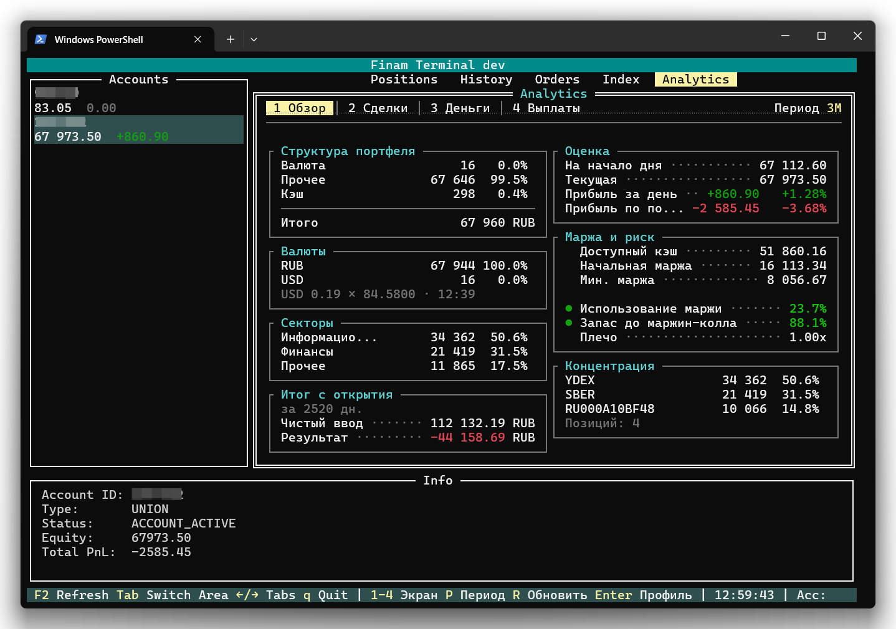
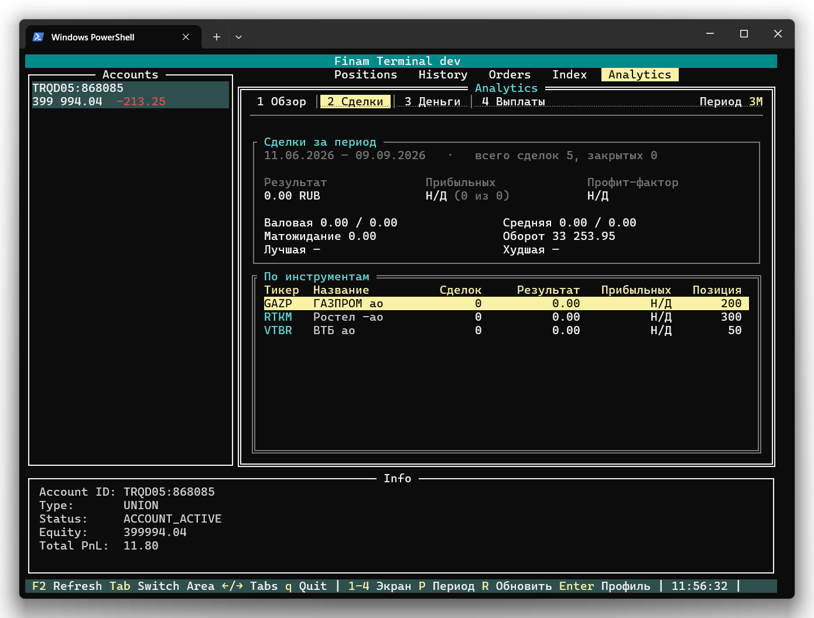
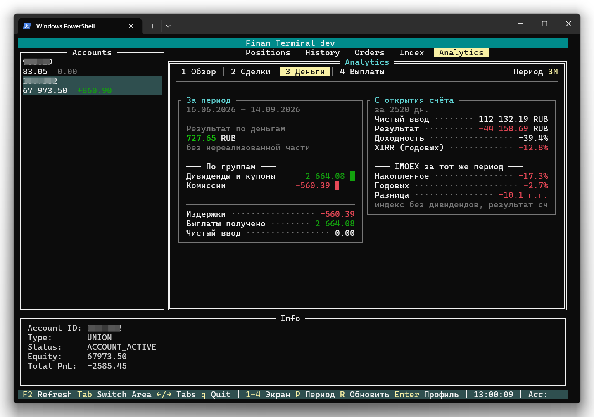

# Вкладка «Analytics»

Вкладка **Analytics** отвечает на вопросы, которые не видны из списка позиций: из чего на самом деле состоит портфель, сколько маржи задействовано и далеко ли до маржин-колла, сколько заработано на закрытых сделках, куда ушли деньги, каков итог счёта с момента открытия и обгоняет ли он индекс. Отдельный под-экран показывает ожидаемые выплаты по текущим позициям.

Всё, что показано в «Обзоре», считается из данных, которые терминал и так получает каждые пять секунд, — этот экран не делает ни одного дополнительного запроса. История сделок и транзакций загружается один раз за сессию на счёт, по явному заходу на «Сделки» или «Деньги».



## Как открыть

Вкладка — пятая в основной области: **Positions | History | Orders | Index | Analytics**.

Когда фокус на основной таблице:

| Клавиша | Действие |
|---------|----------|
| → | Следующая вкладка (с «Index» — на «Analytics») |
| ← | Предыдущая вкладка (с «Positions» — сразу на «Analytics») |

Весь раздел заключён в рамку — такую же, как вокруг остальных разделов терминала, и с той же двойной линией, пока он в фокусе. Под-экраны переключаются цифрами и показаны табами в верхней строке этой рамки; активный подсвечен жёлтым, текущий период прижат к правому краю той же строки:

```
╔ Analytics ═══════════════════════════════════════════════╗
║  1 Обзор │ 2 Сделки │ 3 Деньги │ 4 Выплаты     Период 3М ║
║ ──────────────────────────────────────────────────────── ║
║                                                          ║
║ ┌ Структура портфеля ────────┐┌ Оценка ────────────────┐ ║
```

| Клавиша | Действие |
|---------|----------|
| **1**–**4** | Под-экран |
| **P** (или **З**) | Следующий период (действует на «Сделки» и «Деньги») |
| **R** (или **К**) | Обновить текущий под-экран |
| **↑** / **↓** | Перемещение по строкам таблицы («Сделки», «Выплаты») |
| **Enter** | Профиль инструмента из строки таблицы |
| **A** (или **Ф**) | Заявка по инструменту из строки таблицы |
| ← / → | Переключение вкладок |

Цифры и **P** работают только пока открыта эта вкладка — на остальных вкладках те же клавиши достаются тому, что в фокусе.

Переключение между под-экранами не делает запросов: всё рисуется из того, что уже загружено. К брокеру обращаются только два действия — первый заход на «Сделки»/«Деньги» (загрузка истории) и первый заход на «Выплаты» (календари).

## Как читать экран

Вкладка построена из **панелей** — блоков с рамкой и названием в левом верхнем углу («Структура портфеля», «Маржа и риск», «За период» и так далее). Несколько правил действуют на всех под-экранах.

| Элемент | Что означает |
|---------|--------------|
| **Высота панели** | Панель занимает ровно столько строк, сколько в ней содержимого. Свободное место внизу колонки остаётся без рамки — рамка вокруг пустоты читается как сломанная панель. Если содержимого в колонке больше, чем помещается, нижние панели ужимаются по порядку, а та, которой не хватает даже на одну строку, не показывается вовсе: обрубок панели говорит меньше, чем её отсутствие. |
| **Пустая таблица** | Таблица без строк убирается целиком, а не рисуется одними заголовками: объяснение уже стоит в панели над ней. |
| **Точки между подписью и числом** | `Текущая ········ 1 234 567.89` — подпись и значение одной строки. На узком терминале сокращается **подпись**, а не число. |
| **Полоса** | Доля или величина строки относительно самой крупной в блоке. Полоса рисуется до правого края панели, поэтому на широком терминале она подробнее. Очень маленькая доля всё равно оставляет тончайшую отметку: «мало» и «ничего» — разные факты. |
| **Крупные показатели сверху** | Две строки: серая подпись, под ней жирное значение. Так набраны самые важные цифры экрана — результат, доля прибыльных, профит-фактор, результат по деньгам. |
| **Цвет суммы** | Зелёный — больше нуля, красный — меньше, белый — ровно ноль. Нулевой результат не хорошая и не плохая новость, и красить его в любую сторону значило бы сказать то, чего в числе нет. |
| **● перед показателем** | Уровень риска. Кружок дублирует цвет, чтобы показатель читался и на монохромном терминале, и при дальтонизме. |
| **`Н/Д` серым** | Брокер не сообщил данных, из которых считается показатель. Это **не ноль**: ноль вместо неизвестного значения не подставляется никогда. |
| **`—`** | Значения нет: нулевая позиция, оферта без суммы, купон с ещё не установленной ставкой, неизвестная граница истории. |
| **`*` жёлтым** | Строка неполная — по инструменту есть продажи без цены входа. |
| **Серый текст** | Всё, что экран говорит о себе: оговорки, пустые состояния, причины отказа. |
| **Узкий терминал** | Строки в панелях не переносятся, а обрезаются по краю: свёрнутая пополам строка разрушает колонку цифр, к которой относится. |

Суммы в разных валютах **никогда не складываются**: в Trade API нет курсов. Базовая валюта счёта — рубль, если на счёте есть рублёвый остаток; иначе валюта первой денежной строки; иначе рубль. Всё остальное показывается отдельными строками — остатки в других валютах, например, строками `остаток <валюта>` в панели «Маржа и риск».

## Под-экран «Обзор»

Две колонки из отдельных панелей: слева — структура портфеля, секторы и итог с открытия счёта, справа — оценка счёта, маржа с риском и концентрация. Данные показываются **для выбранного счёта**; при смене счёта в левой панели обе колонки пересчитываются.

Обзор перерисовывается на каждом пятисекундном тике и не делает ни одного запроса.

### Панель «Структура портфеля»

Портфель разложен по типам инструментов. Каждая строка — название группы, сумма, доля и полоса:

```
Акции              1 240 500   61.2%  ██████████████▊
Облигации            420 000   20.7%  ████▉
Кэш                  367 800   18.1%  ████▎
──────────────────────────────────────────────────
Итого              2 028 300 RUB
```

| Группа | Что попадает |
|--------|--------------|
| **Акции** | обыкновенные и привилегированные акции (`EQUITIES`) |
| **Облигации** | облигации всех видов (`BONDS`) |
| **Фонды** | БПИФы и ETF (`FUNDS`) |
| **Фьючерсы** | фьючерсные контракты (`FUTURES`) |
| **Опционы** | опционы (`OPTIONS`) |
| **Валюта** | валютные инструменты (`CURRENCIES`) |
| **Прочее** | всё остальное — индексы, спреды, свопы и инструменты, тип которых брокер не указал |
| **Кэш** | свободные деньги в базовой валюте счёта; строка показывается при положительном остатке (и всегда, если других строк в панели нет) |

Порядок строк постоянный — от акций к «Прочему», и кэш последним. Сортировка по величине заставляла бы строки прыгать между тиками, а такую таблицу невозможно читать.

Пустые группы не показываются. Строка **Прочее** — не признак ошибки: в каталоге брокера почти 300 000 инструментов, и самая большая их часть помечена типом `OTHER`; если такая бумага есть в портфеле, она честно попадёт в «Прочее».

Под чертой — строка **Итого**: база, от которой считаются все доли, и валюта счёта.

Ниже итога могут появиться пометки о том, что в расчёт не вошло:

| Строка | Что произошло |
|--------|---------------|
| `без цены: N` | по позиции нет ни живой котировки, ни цены брокера — оценить её нечем |
| `в других валютах: N` | позиция в валюте, отличной от базовой валюты счёта; курсов в Trade API нет, конвертировать нечем |

> Сейчас брокер не сообщает валюту инструмента вместе с позицией, поэтому строка `в других валютах` на практике не появляется: все позиции считаются в базовой валюте счёта. Позиция с неизвестной валютой из расчёта **не** исключается — гадать здесь значило бы молча уменьшать портфель.

> **Как считается доля.** База всех долей — это сумма стоимостей позиций плюс денежный остаток в базовой валюте счёта. Эквити брокера для долей намеренно не используется: оно включает маржинальные средства, и тогда доли не складывались бы в ваш портфель. Стоимость позиции — та же, что в колонке **Value** вкладки [«Позиции»](positions.md): обе колонки считаются одной и той же функцией, поэтому разойтись не могут.
>
> Короткая позиция входит в базу **по модулю**: шорт увеличивает размер портфеля так же, как лонг, и не должен гасить длинную позицию. Отрицательный денежный остаток — это заём; он в базу не входит и показан отдельной строкой в панели «Маржа и риск». Положительный остаток в другой валюте в базу тоже не входит — пересчитать его не по чему, — и показан там же строкой `остаток <валюта>`.

### Панель «Секторы»

Та же разбивка, но по секторам экономики: строка сектора, сумма, доля, полоса. Сортировка — от большего к меньшему, «Прочее» всегда последним: это остаток, а не сектор.

**Тип инструмента** приходит в общем списке бумаг, который терминал загружает один раз при запуске. Ничего дополнительно для этого не запрашивается.

**Сектор** берётся из состава Индекса МосБиржи — того же, что показывает вкладка [«Индекс»](index-tab.md), с общим кешем на сутки. Бумаги вне состава индекса попадают в сектор «Прочее».

Если состава нет, панель говорит об этом вместо разбивки:

| Строка | Когда |
|--------|-------|
| `состав индекса загружается…` | загрузка идёт |
| `состав индекса недоступен` | загрузка не удалась или ещё не начиналась; `R` повторяет её |
| `нет данных по секторам` | состав загружен, но ни одна позиция в него не попала |

Показать всё одним «Прочим» значило бы выдать отсутствие данных за результат, поэтому панель предпочитает сказать прямо. Остальные панели при этом работают.

### Панель «Итог с открытия»

Те же цифры, что в правой колонке «Денег»: чистый ввод, результат, доходность, XIRR и сравнение с IMOEX. Их считает одна и та же функция, поэтому разойтись они не могут — подробное описание полей в разделе [«С открытия счёта»](#панель-с-открытия-счёта).

Пока история не загружена, в панели стоит подсказка:

```
Откройте «Сделки» или «Деньги»,
чтобы загрузить историю счёта
```

«Обзор» не начинает загрузку сам: она намеренно дорогая, и запускать её за спиной у пользователя было бы неправильно.

### Панель «Оценка»

Сколько стоит счёт и сколько он заработал — те же четыре цифры, с которых брокер начинает сводку по счёту в своём терминале:

```
На начало дня ························· 67 585.92
Текущая ······························· 67 629.18
Прибыль за день ················· +43.26   +0.06%
Прибыль по позициям ·········· -3 041.57   -4.35%
```

| Строка | Что показывает | Откуда |
|--------|----------------|--------|
| **На начало дня** | оценка счёта на начало торгового дня | текущая оценка минус прибыль за день |
| **Текущая** | текущая стоимость счёта по оценке брокера (эквити) | `equity` из ответа брокера |
| **Прибыль за день** | результат позиций за сегодня; процент — от оценки на начало дня | сумма дневного P&L по позициям |
| **Прибыль по позициям** | нереализованный результат по открытым позициям; процент — от стоимости их покупки (средняя цена × количество, шорт по модулю) | `unrealized_profit` из ответа брокера |

Суммы со знаком: прибыль начинается с `+`, убыток с `-`, цвет — как у любой суммы на вкладке. Проценты стоят в отдельной колонке и выровнены друг под другом; у них два знака после запятой, потому что дневное движение часто меньше процента.

> **Оценка на начало дня** брокером не сообщается — она вычисляется. Вычитание точно, только если за день на счёт не приходили и не уходили деньги: ввод, вывод, комиссия или купон меняют текущую оценку, но не меняют дневной результат ни одной позиции.

Для позиций срочного рынка (FORTS) брокер не сообщает ни дневной P&L, ни среднюю цену. Поэтому:

| Ситуация | Что показывается |
|----------|------------------|
| По части позиций нет дневного P&L | **Прибыль за день** — сумма по тем, что его сообщили, под панелью жёлтая строка `без дневного P&L: N`; **На начало дня** и процент за день — **Н/Д**: они были бы неверны ровно на недостающую часть |
| Дневного P&L нет ни по одной позиции | **Прибыль за день** и **На начало дня** — **Н/Д** |
| На счёте только деньги | прибыль за день — честный ноль, оценка на начало дня равна текущей |
| Хотя бы у одной позиции нет средней цены | сумма **Прибыли по позициям** показывается, процент — **Н/Д**: результат брокера охватывает все позиции, и процент от стоимости лишь части из них был бы завышен |
| Брокер не сообщил эквити или нереализованный результат | соответствующая строка — **Н/Д** |

### Панель «Маржа и риск»

Сначала — то, что сообщает сам брокер:

| Строка | Что показывает | Когда видна |
|--------|----------------|-------------|
| **остаток `<валюта>`** | денежный остаток в валюте, отличной от базовой; в доли структуры не входит — пересчитать его не по чему | если такой остаток есть |
| **заём `<валюта>`** | отрицательный денежный остаток — деньги, взятые в долг; красным | если такой остаток есть |
| **Доступный кэш** | свободные средства для новых сделок | если брокер прислал маржинальные данные |
| **Начальная маржа** | обеспечение, зарезервированное под открытые позиции | маржинальный счёт (MC) |
| **Мин. маржа** | уровень, ниже которого начинается принудительное закрытие | маржинальный счёт (MC) |
| **ГО FORTS** | гарантийное обеспечение под позиции срочного рынка на едином счёте — сумма поддерживающего ГО, которое брокер сообщает по каждой такой позиции | маржинальный счёт (MC), на котором есть позиции FORTS |
| **Резерв ГО** | гарантийное обеспечение, удерживаемое биржей | срочный счёт (FORTS) |

Текущая стоимость счёта (эквити) стоит строкой **Текущая** в панели «Оценка» прямо над этой — повторять её здесь значило бы поставить одно и то же число в две рамки через несколько строк. От неё считаются три вычисленных числа:

| Показатель | Формула | Что означает |
|------------|---------|--------------|
| **Использование маржи** | начальная маржа / эквити (на FORTS — резерв ГО / эквити) | какая доля счёта уже задействована под обеспечение |
| **Запас до маржин-колла** | (эквити − минимальная маржа) / эквити | сколько ещё может упасть счёт до принудительного закрытия |
| **Плечо** | сумма стоимостей позиций / эквити | во сколько раз позиция больше собственных средств |

> Терминал брокера показывает «уровень маржи» как эквити / начальная маржа — например, 419%. Это то же **Использование маржи**, только перевёрнутое: 1 / 4,19 = 23,9%.

Цвета и кружки:

- **Использование маржи**: ниже 50% — зелёный, от 50 до 80% — жёлтый, 80% и выше — красный.
- **Запас до маржин-колла**: шкала зеркальная — выше 50% зелёный, от 20 до 50% жёлтый, 20% и ниже красный.
- **Плечо** — без цвета и без кружка: универсально «правильного» плеча не существует, оно зависит от стратегии.

Значение ровно на границе всегда показывается более осторожным цветом.

#### Когда вместо числа стоит «Н/Д»

Серое **Н/Д** означает «брокер не сообщил», а не «ноль».

| Ситуация | Что показывается |
|----------|------------------|
| Маржинальный счёт (MC) | все три показателя |
| Срочный счёт (FORTS) | использование ГО считается из резерва; запас и плечо — **Н/Д**: минимальной маржи такой счёт не сообщает |
| Счёт MCT или без данных о портфеле | все три показателя — **Н/Д** |
| Эквити нулевое, отрицательное или нечитаемое | все три показателя — **Н/Д**: делить не на что |

### Панель «Концентрация»

Три крупнейшие позиции по доле — тикер, сумма, доля, полоса — и под ними серая строка `Позиций: N`: сколько позиций вошло в расчёт базы.

Если позиций нет, панель говорит `нет позиций`, но строку со счётчиком всё равно показывает.

### Состояния «Обзора»

| Что видно | Когда |
|-----------|-------|
| `Счёт не выбран` | список счетов пуст или счёт не выбран |
| `Ошибка при загрузке данных от брокера. Попробуйте обновить позже.` красным | брокер не отдал данные по счёту; сообщение стоит в верхней панели каждой колонки — «Структура портфеля» и «Оценка» |
| `Н/Д — в портфеле нет оценённых активов` | ни одну позицию не удалось оценить и денег в базовой валюте нет |

## Под-экран «Сделки»

Реализованный результат по закрытым сделкам за выбранный период и статистика по ним.



### Панель «Сделки за период»

Первая строка — границы окна и объём выборки:

```
01.06.2026 — 08.09.2026   ·   всего сделок 148, закрытых 92
```

**Всего сделок** — сырые сделки, попавшие в период. **Закрытых** — сопоставленные пары «вход — выход»: одна сделка может закрыть несколько лотов, а может не закрыть ничего.

Ниже — три крупных показателя:

| Показатель | Как считается |
|------------|---------------|
| **Результат** | сумма результатов закрытых пар, в базовой валюте счёта |
| **Прибыльных** | прибыльные / (прибыльные + убыточные); рядом серым `(N из M)` — сколько сделок было прибыльными из всех закрытых. Нулевые сделки в долю не входят |
| **Профит-фактор** | валовая прибыль / модуль валового убытка |

И детали в двух колонках:

| Показатель | Как считается |
|------------|---------------|
| **Валовая** | суммы положительных и отрицательных результатов отдельно, через `/` |
| **Средняя** | средняя прибыльная и средняя убыточная сделка, через `/` |
| **Матожидание** | результат / число закрытых сделок, **включая нулевые** |
| **Оборот** | цена × количество по всем сырым сделкам периода, в обе стороны |
| **Лучшая** | тикер и результат самой прибыльной закрытой сделки |
| **Худшая** | тикер и результат самой убыточной |

Нулевая сделка не входит в долю прибыльных, но входит в матожидание. Это не непоследовательность: сделка, не давшая ничего, ничего не говорит о том, работает ли подход, но она безусловно часть того, сколько принесла средняя сделка.

**Профит-фактор** может быть не числом:

- **∞** — прибыль есть, убытков нет. У отношения в этом случае нет значения, и показывать очень большое число было бы враньём.
- **Н/Д** — ни прибыли, ни убытка. Делить нечего.

**Лучшая / худшая** показывают `—`, если в периоде не было ни одной прибыльной (соответственно убыточной) сделки.

Сделки в других валютах не складываются с базовой и получают по собственной серой строке:

```
USD: 4 сделок, результат 128.40
```

### Пометки неполноты

Под деталями появляются жёлтые строки, если результат неполный:

| Строка | Что произошло |
|--------|---------------|
| `N шт. продано без цены входа — результат неполный` | в загруженной истории есть продажа, но нет покупки, которую она закрывает. Обычная причина — счёт старше, чем удалось загрузить. Такая продажа в результат **не** входит: выдумывать цену входа хуже, чем сказать, что её нет. В таблице строка такого инструмента помечена `*` в колонке «Позиция» |
| `N записей не прочитано` | записи, в которых не удалось разобрать инструмент, направление, цену или количество. Они считаются, а не молча заменяются нулями |

### Как считается результат: FIFO

Каждая продажа закрывается против самой ранней открытой покупки по этой бумаге (first in — first out).

- Результат сделки = `(цена выхода − цена входа) × количество` для лонга и с обратным знаком для шорта.
- Результат относится к **моменту выхода**: позиция, открытая два года назад и закрытая вчера, попадает во вчерашний период целиком.
- Одна сделка, закрывающая несколько лотов, даёт несколько закрытых пар — у каждой своя цена и дата входа.
- Сделка больше открытого объёма закрывает что может и открывает позицию в другую сторону (переворот).
- **НКД облигации входит в цену**: при покупке увеличивает стоимость входа, при продаже прибавляется к выручке, и распределяется пропорционально по закрываемым лотам. Поэтому круговая сделка по облигации при неизменной котировке всё равно даёт результат.

### Таблица «По инструментам»

| Колонка | Что показывает |
|---------|----------------|
| **Тикер** | инструмент, голубым — это опознавательный знак строки |
| **Название** | человекочитаемое название бумаги |
| **Сделок** | закрытых пар за период |
| **Результат** | сумма по инструменту, зелёным или красным |
| **Прибыльных** | доля выигрышных закрытых сделок или `Н/Д`, если решённых сделок не было |
| **Позиция** | текущая открытая позиция по данным истории; `—` при нулевой, `*` — если по бумаге есть продажи без цены входа |

Строки отсортированы по результату — лучшая сверху; при равенстве по алфавиту, чтобы таблица не перетасовывалась между перерисовками.

Колонка **Позиция** периодом не фильтруется: что держится — то держится, независимо от выбранного окна. Инструмент, который держат и по которому за период ничего не закрыли, всё равно попадает в таблицу.

### Действия из строки

| Клавиша | Действие |
|---------|----------|
| **↑** / **↓** | Перемещение по строкам |
| **Enter** | Профиль инструмента |
| **A** (или **Ф**) | Модальное окно заявки по этому инструменту |

### Состояния экрана «Сделки»

| Что видно | Когда |
|-----------|-------|
| `История ещё не загружена` | первый заход — идёт загрузка, статус прогресса виден строкой выше |
| `За выбранный период сделок нет` | история загружена, но окно пустое; таблица при этом скрыта |

## Под-экран «Деньги»

Две колонки: слева — движение денег за период, справа — итог с открытия счёта и сравнение с индексом.



### Панель «За период»

Первая строка — границы окна. Ниже крупно:

| Показатель | Как считается |
|------------|---------------|
| **Результат по деньгам** | реализованный результат по сделкам + полученные выплаты − издержки |

Под ним стоит серая подпись `без нереализованной части` — и это важно: переоценка открытых позиций сюда не входит, потому что у Trade API нет истории эквити и восстановить нереализованный результат на начало периода нечем.

#### Блок «По группам»

Каждая группа транзакций — строка с суммой и полосой. Полосы измеряются относительно самой крупной группы блока, поэтому сразу видно, что определило период:

| Группа | Категория API | Знак |
|--------|---------------|------|
| Ввод | `DEPOSIT` | + |
| Вывод | `WITHDRAW` | − |
| Дивиденды и купоны | `INCOME` | + |
| Комиссии | `COMMISSION` | − |
| Налоги | `TAX` | − |
| Проценты по займу | `LOAN` | − |
| Штрафы | `FINE` | − |
| Переводы бумаг | `TRANSFER` | в штуках, в деньги не идёт |
| Сделки | транзакции, отражающие сделку | не входит ни в один итог |
| Прочее | `INHERITANCE`, `CONTRACT_TERMINATION`, `OUTCOMES`, `OTHERS` | как прислал брокер |

Порядок строк постоянный, пустые группы пропускаются. Знаки сохраняются такими, как их прислал брокер: расход — отрицательный, потому что деньги ушли именно в эту сторону.

**Переводы бумаг** показываются количеством (`120 шт.`) и полосы не получают: это штуки, а не деньги, и мерить их рублёвой шкалой бессмысленно.

> **Почему «Сделки» отдельно и не входят в итоги.** Покупка бумаги — это движение денег внутри счёта, а результат по ней уже посчитан по FIFO. Если бы транзакция сделки попадала в потоки, результат считался бы дважды. Поэтому такая транзакция показывается своей строкой и ни в один итог не входит — какой бы категорией она ни пришла.

Если движений не было, вместо блока стоит `За период движения денег не было`.

#### Итоги периода

Под чертой — три строки:

| Итог | Что входит |
|------|------------|
| **Издержки** | комиссии + налоги + проценты по займу + штрафы |
| **Выплаты получено** | дивиденды и купоны |
| **Чистый ввод** | ввод − вывод |

Потоки в других валютах никогда не складываются с базовой и получают собственные серые строки:

```
USD: ввод 500.00, издержки -3.20
```

### Панель «С открытия счёта»

Это единственный горизонт, на котором доходность считается честно: у обоих концов есть точные значения — до открытия на счёте не было ничего, а его текущая стоимость приходит каждые пять секунд.

Первая строка — длительность горизонта (`за 1 284 дн.`).

| Показатель | Как считается |
|------------|---------------|
| **Чистый ввод** | все вводы минус все выводы за всё время |
| **Результат** | эквити − чистый ввод |
| **Доходность** | результат / чистый ввод |
| **XIRR (годовых)** | денежно-взвешенная годовая доходность |

**XIRR** — ставка, при которой приведённая стоимость всех потоков равна нулю: вводы со знаком минус, выводы с плюсом, текущее эквити как положительный поток «сегодня». Время — ACT/365. Это правильная метрика, когда вводы и выводы происходят в моменты, которые вы выбирали сами.

Потоками считаются **только вводы и выводы**. Комиссия, дивиденд или покупка происходят внутри счёта: это часть результата, а не часть того, что вы вложили.

Когда показателя нет, причина стоит отдельной строкой под ним:

| Показывается | Почему |
|--------------|--------|
| **Доходность: Н/Д** | чистый ввод нулевой или отрицательный — доли от этого не бывает. Результат при этом всё равно показан |
| **XIRR: Н/Д**, `период короче 30 дней` | приводить три недели к годовым — арифметика, а не информация |
| **XIRR: Н/Д**, `нет ввода и вывода` | в загруженной истории нет ни одного ввода или вывода; решать уравнение не по чему |
| **XIRR: Н/Д**, `не удалось вычислить` | в области поиска нет ставки, которая уравновешивает потоки |

Строка `не учтено: 500.00 USD` перечисляет потоки в других валютах, которые в расчёт не вошли.

Если история загружена не полностью, горизонт начинается **с границы загруженного**, а не с открытия счёта: измерять частичную историю относительно полного текущего эквити значило бы записать счёту деньги, происхождение которых он объяснить не может.

#### Блок «IMOEX за тот же период»

| Показатель | Что показывает |
|------------|----------------|
| **Накопленное** | изменение индекса за горизонт целиком |
| **Годовых** | то же, приведённое к годовым |
| **Разница** | XIRR счёта минус годовые индекса, в процентных пунктах; положительная — счёт обгоняет индекс |

Строка «Разница» появляется, только если посчитаны обе величины. Если горизонт короче 30 дней, «Годовых» показывает `Н/Д` с причиной `период короче 30 дней`.

Подпись `индекс без дивидендов, результат счёта — с ними` стоит не для порядка: IMOEX — ценовой индекс, он не учитывает дивиденды своих компонентов, а результат вашего счёта их включает. Без этой оговорки сравнение льстит счёту примерно на пару процентов годовых.

`IMOEX: нет данных` означает, что баров за нужные даты нет. Обычная причина — горизонт старше истории индекса. Показать приблизительное сравнение было бы хуже, чем не показать никакого: у читателя нет способа отличить одно от другого.

### Состояния экрана «Деньги»

| Что видно | Когда |
|-----------|-------|
| `История ещё не загружена` в обеих панелях | первый заход, идёт загрузка |
| `За период движения денег не было` | история есть, но в окне нет ни одной денежной транзакции |

## Под-экран «Выплаты»

Ожидаемые поступления по текущим длинным позициям: дивиденды по акциям и фондам, купоны, амортизации и оферты по облигациям.

> 📸 **Нужен скриншот:** `media/analytics_payouts.png` — под-экран «Выплаты»: панель «Ожидаемые выплаты» с суммами за 30 и 90 дней и таблица «По датам» под ней.
<!--  -->

### Панель «Ожидаемые выплаты»

Одна строка с двумя горизонтами и подписью под ней:

```
30 дней  12 400.00 RUB     90 дней  38 250.00 RUB
суммы до налога
```

Суммы приводятся по валютам и между собой не складываются. `—` означает, что в этом окне поступлений нет.

Подпись `суммы до налога` — потому что брокер удерживает налог при выплате, а ставку, которая к вам применится, API не сообщает. Вычитать догадку было бы хуже, чем честно показать сумму до удержания.

### Таблица «По датам»

| Колонка | Что показывает |
|---------|----------------|
| **Дата** | дата выплаты, по возрастанию |
| **Тикер** | инструмент, голубым |
| **Вид** | Дивиденд, Купон, Амортизация или Оферта |
| **На бумагу** | сумма на одну бумагу; `—` у оферты и у выплаты, сумму которой брокер ещё не назвал |
| **Кол-во** | сколько бумаг в позиции |
| **Сумма** | на бумагу × количество, зелёным; `—` у оферты и у выплаты, сумму которой брокер ещё не назвал |
| **Вал.** | валюта выплаты |

Строки отсортированы по дате, при совпадении — по тикеру. Из строки работают те же **Enter** (профиль) и **A** (заявка), что и на «Сделках».

> **Выплата без суммы.** Брокер иногда сообщает дату выплаты, но не её размер — так приходит очередной купон облигации с плавающей ставкой, пока ставка на период не установлена. Такая строка остаётся в списке (дата настоящая и полезная), но в колонках денег стоит `—`, в итоги «30/90 дней» она не входит, а под итогами появляется строка `по N выплатам сумма не определена`. Показывать вместо этого `0.00` значило бы утверждать «вы не получите ничего» — это другое утверждение, и оно неверно.

Что в список **не** попадает:

- **Шорты** — короткая позиция выплаты не получает, а платит.
- **Инструменты без выплат** — фьючерсы, валюта и всё, у чего календаря нет.
- **Инструменты неизвестного типа** — если бумаги нет в загруженном при старте списке, спрашивать не о чем.
- **Прошедшие выплаты** — учитываются только даты начиная с сегодняшней.

**Оферта** показывается строкой с датой, но без суммы: это дата, в которую вы можете действовать, а не платёж, который вы получите. В итоги она не входит.

### Состояния и сообщения

| Что видно | Когда |
|-----------|-------|
| `Загрузка ожидаемых выплат…` | идёт первый проход по позициям |
| `По текущим позициям ожидаемых выплат нет` | проход завершён, платить нечему; таблица скрыта |
| `календарь выплат недоступен: SBER, GAZP` | календарь этих бумаг запросить не удалось; остальной список на месте — одна неудача не стоит всего экрана |
| `лимит API — список неполный, R повторить` | брокер отказал по лимиту, обход остановлен |
| `N записей без даты или суммы` | в календаре есть записи, которые нельзя использовать: нет даты или сумма не читается |

## Период

Пресеты переключаются клавишей **P** (или **З**) и действуют на «Сделки» и «Деньги»:

**1М → 3М → 1Г → YTD → Всё → 1М**

| Пресет | Окно |
|--------|------|
| **1М** | последние 30 дней |
| **3М** | последние 90 дней |
| **1Г** | последние 365 дней |
| **YTD** | с 1 января текущего года |
| **Всё** | с даты открытия счёта |

Начальное значение — **3М**: достаточно длинное окно, чтобы вместить несколько круговых сделок, и достаточно короткое, чтобы говорить о недавнем поведении. Активный период показан справа в шапке под-экранов и не сбрасывается при смене счёта: это выбор о том, как вы хотите смотреть, а не о том, на что.

**YTD** — с 1 января по вашему местному времени, а не по UTC: вечером 31 декабря в Москве «с 1 января» должно означать всё ещё этот год.

**Всё** при неизвестной дате открытия счёта берёт горизонт в двадцать лет — заведомо больше любой доступной истории.

Смена периода **не делает ни одного запроса**. Вся история загружается один раз, и каждый пресет — фильтр по тому, что уже в памяти. Именно ради этого загрузчик платит за полный проход сразу.

Записи без даты не попадают ни в один период: одна такая запись, посчитанная везде, испортила бы каждое окно сразу.

## Загрузка истории

История счёта — самая дорогая операция в терминале: у старого счёта это десятки запросов. Поэтому она делается **один раз за сессию на счёт**, и только когда вы открыли «Сделки» или «Деньги». Пятисекундный тик её не трогает никогда.

Что происходит при первом заходе:

1. Терминал считает, сколько чанков понадобится. Если больше пяти — сначала одним запросом проверяет остаток квот и, если его не хватает, **не начинает** проход.
2. Идёт назад от сегодняшнего дня окнами по 92 дня, с паузой 150 мс между запросами.
3. Если ответ пришёл ровно на лимит записей, окно считается урезанным: оно делится пополам и запрашивается заново, вплоть до одного дня.
4. Вместе с историей загружаются два узких окна дневных баров IMOEX для сравнения — по одному на каждый конец горизонта.

Пока идёт загрузка, под шапкой видно, на каком запросе проход и до какой даты уже дошёл.

### Строки состояния

Строка одна и та же для «Сделок» и «Денег» — она относится к счёту, а не к экрану.

| Строка | Что произошло |
|--------|---------------|
| `История: загрузка…` | проход начат, первый ответ ещё не пришёл |
| `История: запрос 14 из ~40, загружено с 12.05.2021` | проход идёт |
| `данные с 12.05.2021, ранняя история не загружена` | проход остановлен предохранителем по числу запросов либо загружен не целиком; всё, что загружено, показано |
| `лимит API — история загружена с 12.05.2021, R догрузить` | брокер отказал по лимиту; частичные данные остались на экране |
| `загрузка не начата: не хватает квот API, R повторить` | предпроверка квот не пропустила проход |
| `загрузка прервана — история с 12.05.2021, R повторить` | сеть или другая ошибка посреди прохода |
| `лимит API исчерпан — подождите и нажмите R` | проход не загрузил ничего из-за лимита |
| `не удалось загрузить историю, R повторить` | проход не загрузил ничего по другой причине |
| `нет данных о начале истории счёта` | брокер не сообщил ни даты первой сделки, ни даты первого движения — окно, которое можно было бы пройти, отсутствует |
| `подождите N с до следующего обновления` | `R` нажата раньше, чем истёк кулдаун |

Прочерк `—` вместо даты в этих строках означает, что граница загруженного так и не была установлена.

**Частичные данные всегда остаются на экране.** Три года истории десятилетнего счёта с честной подписью полезнее, чем сообщение об ошибке.

Автоматического повтора нет нигде. На отказ по лимиту это было бы худшей из возможных реакций: каждый отказанный запрос тоже расходует квоту.

### Обновление по R

`R` обновляет только текущий под-экран — так нажатие на «Обзоре» не может потратить проход истории, который принадлежит «Сделкам» и «Деньгам».

| Под-экран | Что делает `R` |
|-----------|----------------|
| **Обзор** | перезапрашивает состав индекса, если его нет (это единственное, чего экрану может не хватать), и перерисовывается |
| **Сделки**, **Деньги** | догружает **хвост** — последние сутки — и вливает его в кеш, сверяя записи по идентификатору. Весь счёт заново не перечитывается. Если истории ещё нет, делается полный проход |
| **Выплаты** | пересобирает прогноз |

Между проходами истории действует кулдаун 10 секунд; `R` внутри него сообщает, сколько осталось ждать, и запроса не делает.

На «Выплатах» кулдауна нет — и это безопасно: календари кешируются по каждой бумаге на сутки, поэтому повторное обновление в пределах этого окна не стоит ни одного запроса.

При догрузке хвоста пометка о неполноте истории сохраняется: чистый частичный проход не должен стирать тот факт, что исходная загрузка была урезана.

## Сколько это стоит в запросах

| Данные | Источник | Цена |
|--------|----------|------|
| Позиции, эквити, котировки | уже в памяти: тик 5 секунд и поток котировок | 0 |
| Кэш, маржа, даты | те же поля того же ответа | 0 |
| Оценка на начало дня, прибыль за день и по позициям, ГО FORTS | те же поля того же ответа: дневной P&L, средняя цена и ГО каждой позиции, нереализованный результат счёта | 0 |
| Тип инструмента | общий список бумаг, загружаемый при старте | 0 |
| Сектор | состав индекса, общий с вкладкой «Индекс», кеш на сутки | 1–2 в сутки |
| История сделок и транзакций | при первом заходе на «Сделки» или «Деньги» | от 2 до ~80 за сессию на счёт, чанками с паузами |
| Бары IMOEX для сравнения | вместе с историей | 2 |
| Календари выплат | при первом заходе на «Выплаты» | по 1 на длинную позицию в сутки |
| Предпроверка квот | перед длинным проходом истории | 1 |

«Обзор» перерисовывается на каждом тике и **не делает ни одного сетевого вызова**. Это не побочное свойство реализации, а требование: терминал не должен упираться в лимиты брокера из-за экрана статистики.

Смена периода, повторные заходы на под-экраны и переключение между «Сделками» и «Деньгами» тоже не стоят ничего. Ни один загрузчик не повторяет запрос сам после ошибки — только `R`.

---

| [← Вкладка «Индекс»](index-tab.md) | [Далее: Профиль инструмента →](profile.md) |
|:---|---:|
